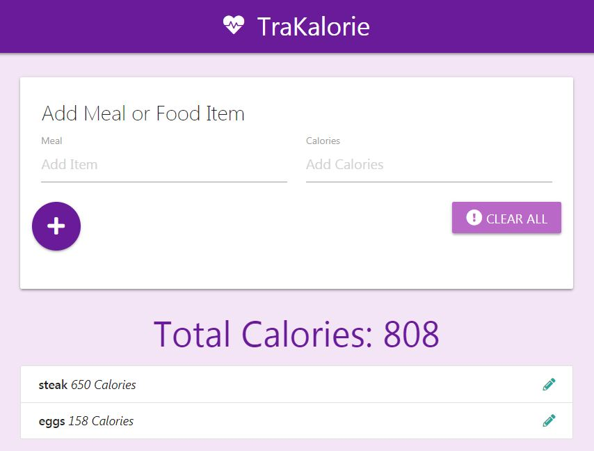
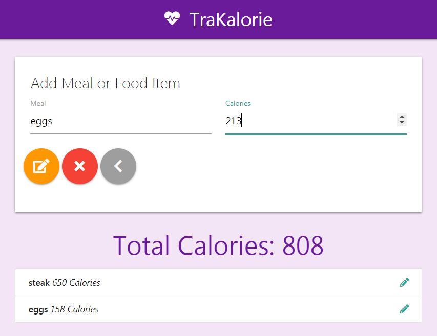
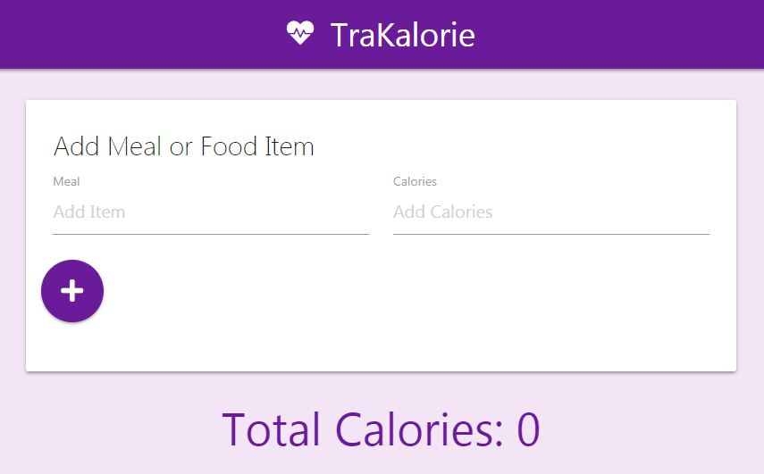

#  TraKalorie

*TraKalorie* is an app created under the direction of [Brad Traversy](https://www.udemy.com/modern-javascript-from-the-beginning/) in his *Modern JavaScript from the Beginning* course. The app employs the module and state JS patterns, and makes use of the following technologies:

  * JavaScript ES6
  * HTML
  * Materialize

### Description and Features

TraKalorie is a simple web interface that allows the input of a food item and it caloric value. It then displays the item, its calorie count, and the total calories for all listed items. As items are added, they appear in the list and their caloric values are added to the total. The app does not allow entry of blank fields.

The pencil icon takes the user to the edit state for that item, where they can edit the item's name or calorie values. Both add and clear buttons are hidden in this state. The delete button removes that item, and the back button closes the edit state. Total calories are updated if applicable.

The clear button removes the entire list, and only appears if the list is populated.

All data persists to local storage, where it is added, updated, or removed based on user interaction. The removal of a final list item is equivalent to mashing clear: local storage is completely emptied in either scenario.